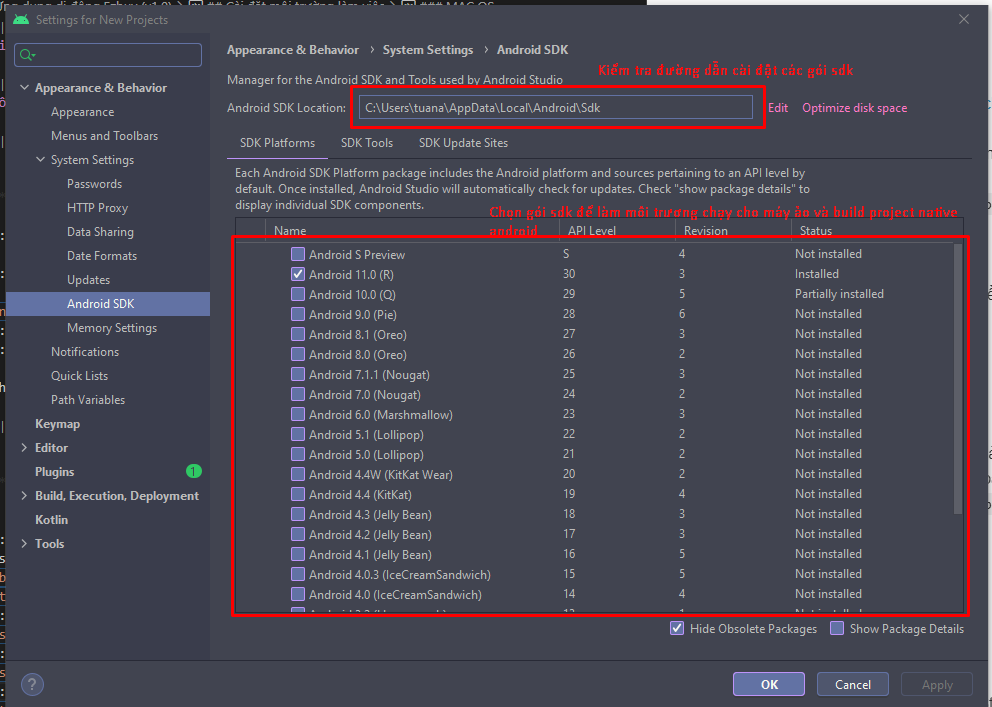
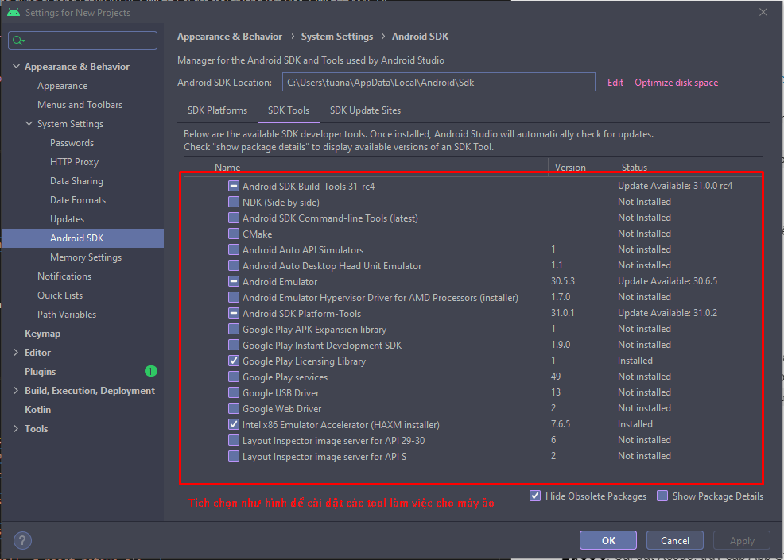
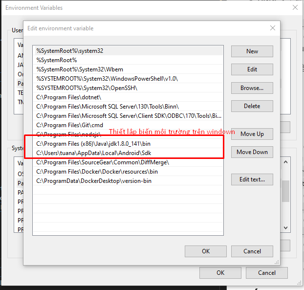
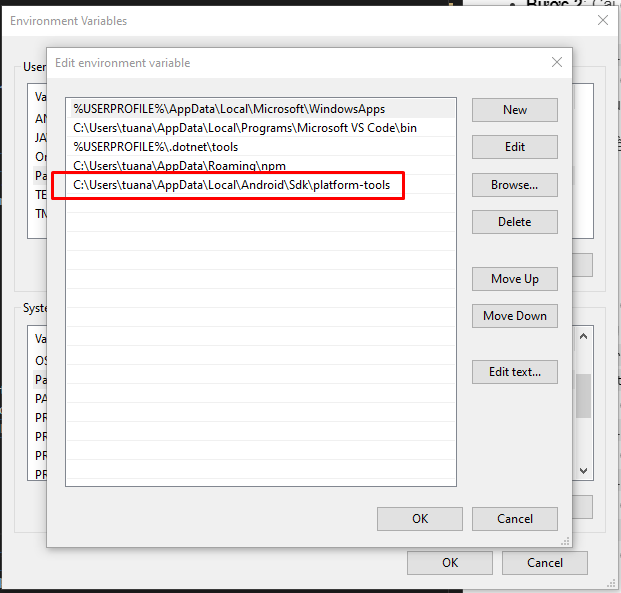

# Ứng dụng di động Efex Warehouse (v1.0)

## Cài đặt môi trường làm việc

### Windows

1. **Android**

- **Bước 1**: Cài đặt Chocolatey từ <https://chocolatey.org> (Chocolatey là trình quản lý các gói thư viện của Windows)
- **Bước 2**: Cài đặt Nodejs Java và Python 2 thông qua Chocolatey sử dụng dòng lệnh sau (dùng cmd để chạy lệnh này):
  `choco install -y nodejs.install python2 jdk8`
- **Bước 3**: Cài đặt Android studio.
- **Bước 4**: Cấu hình biến môi trường.
  
  
  
  

Lưu ý: Trên hệ điều hành windows chỉ có thể build ứng dụng trên Android.

### MAC OS

1. **Android**
2. **IOS**

- **Bước 1**: Cài đặt Brew: Brew là trình quản lý các gói thứ viện, MACOS không tích hợp sẵn và bạn phải sử dụng
  terminal để cài đặt brew bằng cách chạy dòng lệnh sau.
  `{{/usr/bin/ruby -e "$(curl –fsSL https://raw.githubusercontent.com/ Homebrew/install/master/install)"}}`
- **Bước 2**: Cài đặt Nodejs:
  `brew install node`
- **Bước 3**: Cài đặt Watchman:
  `brew install watchman`
- **Bước 4**: Cài đặt react-native:
  `npm install -g react-native-cli`
- **Bước 5**: Cài đặt Xcode: truy cập App Store trên MACOS để cài đặt Xcode.

## Cấu trúc thu mục

```
.
├── README.md
├── __tests__
│   └── App-test.tsx
├── android
│   ├── app
│   ├── build
│   ├── build.gradle
│   ├── gradle
│   ├── gradle.properties
│   ├── gradlew
│   ├── gradlew.bat
│   └── settings.gradle
├── app.json
├── babel.config.js
├── index.js
├── ios
│   ├── File.swift
│   ├── Launch\ Screen.storyboard
│   ├── Podfile
│   ├── Podfile.lock
│   ├── Pods
│   ├── EfexWarehouse
│   ├── EfexWarehouse-Bridging-Header.h
│   ├── EfexWarehouse.xcodeproj
│   ├── EfexWarehouse.xcworkspace
│   ├── EfexWarehouseTests
│   └── EfexWarehouse.p12
├── metro.config.js
├── package-lock.json
├── package.json
├── react-native.config.js
├── src
│   ├── @types
│   ├── App.tsx
│   ├── api
│   ├── assets
│   ├── components
│   ├── configs
│   ├── helpers
│   ├── hooks
│   ├── models
│   ├── navigation
│   ├── redux
│   ├── screens
│   ├── shared
│   └── themes
├── tsconfig.json
├── yarn-error.log
└── yarn.lock
```

- **Thư mục android**: Chứa code native android.
- **Thư mục ios**: Chứa code native ios.
- **Thư mục src**: Thư mục chính để chứa code react native.
- [**Thư mục @types** _(xem chi tiết tại
  đây)_](https://github.com/mramra3004/ez-mobile/tree/develop/master/src/%40types)
- **File App.tsx**: Entry point app EfexWarehouse.
- **Thư mục api**: Chứa config và api service.
- **Thư mục assets**: Tài nguyên dùng chung trong app.
- **Thư mục components**: Các base components có thể tái sử dụng nhiều nơi trong app.
- **Thư mục configs**: Chứa các config chung của app.
- **Thư mục helpers**: Các hàm xử lý và tính toán cơ bản.
- **Thư mục hooks**: Chứa các custom hooks
- **Thư mục models**: Chứa các model Request và Response sử dụng call api.
- **Thư mục navigation**: Chứa toàn bộ logic navigation.
- **Thư mục redux**: Chứa config redux, redux saga
- **Thư mục screens**: Các màn hình trong app
- **Thư mục shared**: Các component chung, config đa ngôn ngữ.
- **Thư mục themes**: Chứa Themes app.

**_Lưu ý:_** Một số package sau khi cài đặt vẫn phải thêm code hoặc config trong thư mục native android hay ios nên đọc
kĩ tài liệu khi thêm 1 package mới, trong project này cũng đã đầy đủ package để code 1 dự án thương mại điện tử cho nên
cân nhắc khi thêm 1 package mới có cần thiết hay không. :warning: :warning: :warning:

## Chạy chương trình

### Android

- **Bước 1**: `yarn install` để cài đặt các gói cần thiết.
- **Bước 2**: `cd android && ./gradlew clean` dùng để làm sạch code android native trước khi chạy.
- **Bước 3**: `npm run android` để chạy chương trình.

### IOS

- **Bước 1**: `yarn install` để cài đặt các gói cần thiết.
- **Bước 2**: `cd ios && npx pod install` để build ứng dụng ios native.
- **Bước 3**: `npm run ios` để chạy chương trình.

Lưu ý: Thực hiện lỗi bước nào thì Google để sửa chữa code. :wrench: :wrench: :wrench:
